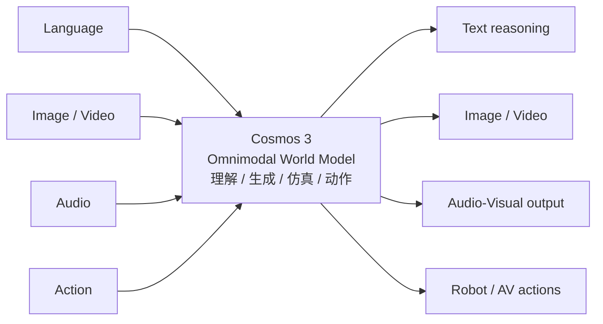
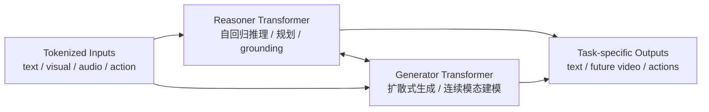
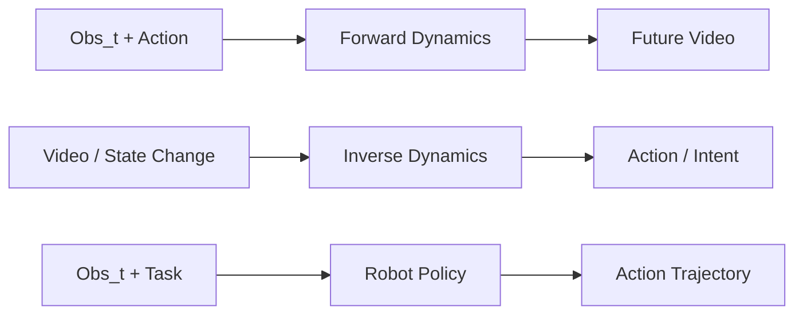

# Cosmos 3: Omnimodal World Models for Physical AI 技术报告中文解读

> 资料基于 NVIDIA Cosmos 3 官方项目页、arXiv 摘要页、Hugging Face Cosmos3 集合和公开报道整理。因用户请求的是外部链接中的论文，本文不提供逐字全文翻译，而提供章节级中英双语释义、技术拆解和重绘框图。

---

## 1. TL;DR：一句话读懂 Cosmos 3

**Cosmos 3 的目标不是再做一个视频生成模型，而是把 VLM、视频生成器、世界模拟器、forward dynamics、inverse dynamics、robot policy 统一到一个 omnimodal world model 里。**

官方摘要称 Cosmos 3 能在一个统一的 **mixture-of-transformers** 架构中联合处理和生成语言、图像、视频、音频和动作序列；官方项目页也强调它把 **understanding、generation、simulation、action** 连接到同一个 shared omnimodal world model 中。

**对具身智能的意义：** 它试图解决“感知模型、生成模型、仿真模型、策略模型割裂”的问题。过去你需要 VLM 看懂场景、视频模型预测未来、policy 输出动作、simulator 评估结果；Cosmos 3 想用一个模型承接这些 I/O 组合。

---

## 2. 论文定位：Cosmos 3 到底是什么？

### 不是单纯 VLM

VLM 主要是 `image/video → text reasoning`；Cosmos 3 还要在 `text / image / video / audio / action` 之间互相转化，包括生成未来视频、推断动作轨迹、产生 robot policy。

### 不是单纯视频生成

普通视频生成重视觉质量；Cosmos 3 更强调物理世界的时空关系、动作因果、可作为 robot / AV 数据生成与评估的世界模拟。

### 不是传统 world model

传统 world model 多是 `state + action → next state`；Cosmos 3 把文本、图像、视频、音频、动作都放进同一模型，支持 forward / inverse dynamics 和生成。

### 不是单一策略模型

它能 post-train 成 robot policy，也能做 image / video generation、VLM reasoning、trajectory reasoning，是一个可后训练的基础模型族。

### 和 Cosmos 2/2.5 的关系

公开资料显示，早期 Cosmos 系列更像多个专用模块：Reason / Predict / Transfer / Policy 等。Cosmos 3 的主张是把这些能力合并到一个统一 omnimodal 架构中，减少开发者在多模型管线之间切换、蒸馏、对齐、拼接的成本。

---

## 3. 章节级中英双语释义（非逐字全文翻译）

> 说明：完整逐字翻译外部 PDF 会涉及版权限制。下面保留关键英文术语与结构，提供“可读性更强的中文释义 + 英文要点”，用于快速掌握全文。

### Abstract / 摘要

**English key idea:** Cosmos 3 is an omnimodal world model that can jointly process and generate language, image, video, audio, and action sequences within a unified mixture-of-transformers architecture.

**中文释义：** Cosmos 3 的核心是“全模态世界模型”。它不是只理解图像，也不是只生成视频，而是在统一架构中同时处理和生成语言、图像、视频、音频、动作序列。它强调的是 physical AI 场景：机器人、自动驾驶、智能空间等需要理解世界、模拟未来、生成动作的系统。

### Introduction / 引言

**English key idea:** Physical AI requires models that can understand, generate, simulate, and act in the physical world. Existing models are often fragmented across perception, generation, simulation, and control.

**中文释义：** 物理 AI 不只需要“看懂图片”，还需要知道动作会如何改变世界，能够预演未来，并输出可执行策略。现有系统通常由 VLM、视频生成器、仿真器、策略模型拼接而成，接口复杂、语义不一致、误差会传递。Cosmos 3 试图用统一模型把这些能力连接起来。

### Model / 模型架构

**English key idea:** The architecture combines autoregressive reasoning with diffusion-style generation through a mixture-of-transformers design.

**中文释义：** Cosmos 3 不是简单把所有模态都塞进一个 Transformer，而是把适合推理/规划的 autoregressive transformer 和适合生成连续视觉/音频信号的 diffusion generation 机制结合起来。Mixture-of-Transformers 的设计可以理解为“不同专家处理不同模态和任务”，同时共享一个全模态世界模型目标。

### Capabilities / 能力

**English key idea:** Cosmos 3 supports vision-language reasoning, image generation, audio-visual generation, robot policy, forward dynamics, and inverse dynamics.

**中文释义：** 它的能力不局限于生成视频，而是覆盖：视觉语言推理、图像生成、音视频生成、机器人策略、给定动作预测未来的 forward dynamics、从状态变化反推动作的 inverse dynamics。这些能力共同构成一个 action-aware world model。

### Data / 数据

**English key idea:** Cosmos 3 is trained with massive multimodal data, including images, videos, audio, text, and human/robot action data, plus synthetic physical AI datasets.

**中文释义：** 数据不只是互联网图文视频，还包括真实和合成视频、环境音频、文本、人类和机器人动作数据，以及面向数字人、物理交互、具身机器人、仓储、自动驾驶的合成数据。这说明 Cosmos 3 的训练目标是建立“物理世界经验库”，而不是单个任务模型。

---

## 4. 核心框图解释（重绘版）

### 图 1：统一全模态 I/O



**解读：** 这张图表达 Cosmos 3 的最核心目标：任意若干输入模态组合，输出任意目标模态。比如 `video + prompt → 驾驶推理`；`image + task → 机器人轨迹`；`observation + action → 未来视频`；`video pair → 反推动作`。

### 图 2：Mixture-of-Transformers + Autoregressive Diffusion



**解读：** Reasoner 更像语言模型/VLM，擅长组织上下文、显式推理、定位对象、规划轨迹；Generator 更像扩散模型，擅长生成高维连续信号，如图像、视频、音频、动作序列。MoT 的价值是避免“用一个 transformer 兼顾所有事情”导致能力互相牵制。

### 图 3：Forward / Inverse Dynamics 与机器人策略



**解读：** 这三条能力链是 Cosmos 3 相比普通 VLM / 视频生成模型最“物理 AI”的部分。Forward dynamics 用来预演动作结果；inverse dynamics 把视频变化解释为动作；policy 直接把视觉和任务转为动作。三者闭环以后，可以做数据生成、策略训练、失败分析和在线规划。

---

## 5. 创新点、要解决的问题和效果

| 问题 | Cosmos 3 的做法 | 为什么重要 |
|---|---|---|
| 多模型管线割裂 | 用统一 omnimodal world model 连接理解、生成、仿真、动作。 | 减少 VLM、视频模型、policy、simulator 之间的接口和语义对齐成本。 |
| 视频生成缺少动作因果 | 引入 action 数据，支持 forward / inverse dynamics。 | 让模型不只是“画视频”，而是能建模“动作导致世界怎样变化”。 |
| 具身泛化差 | 用大规模多模态数据 + 合成物理场景 + 机器人/人类动作数据预训练。 | 为机器人和自动驾驶构造更强的世界先验，减少每个任务从零采集数据。 |
| 生成和推理难以统一 | MoT 架构把 reasoning transformer 与 generation transformer 组合。 | 让模型先理解/规划，再生成未来观测或动作，避免纯扩散模型缺推理、纯 AR 模型弱视觉生成。 |
| 危险/长尾数据难采 | 开放 synthetic datasets 和视频/场景生成能力。 | 适合自动驾驶 rare event、机器人碰撞/失败场景、安全评估等。 |

### 一句话创新概括

```text
Cosmos 3 = Omnimodal tokenization
         + Mixture-of-Transformers
         + autoregressive reasoning
         + diffusion generation
         + action-aware world modeling
         + open physical-AI datasets/checkpoints
```

---

## 6. 使用的数据

公开报道披露的训练数据规模是 **20T multimodal tokens**，包括约 **近 10 亿图像**、**4 亿真实和合成视频**、环境音频、文本，以及人类和机器人动作数据。这个量级表明 Cosmos 3 更像“物理世界版多模态基础模型”，不是某个机器人任务的小模型。

### Hugging Face 开放集合中的数据/模型线索

| 类别 | 公开名称示例 | 用途推断 |
|---|---|---|
| 合成数字人场景 | `PhysicalAI-WorldModel-Synthetic-Digital-Human-Scenes` | 人体、动作、交互、空间关系建模。 |
| 物理交互场景 | `PhysicalAI-WorldModel-Synthetic-Physical-Interaction-Scenes` | 碰撞、接触、物体运动、动力学先验。 |
| 具身机器人场景 | `PhysicalAI-WorldModel-Synthetic-Embodied-Robot-Scenes` | 机器人操作、任务执行、动作到视觉变化。 |
| 仓储操作场景 | `PhysicalAI-WorldModel-Synthetic-Warehouse-Operations-Scenes` | 工业物流、仓储机器人、安全监控。 |
| 自动驾驶场景 | `PhysicalAI-WorldModel-Synthetic-Autonomous-Driving-Scenarios` | 道路交通、长尾事件、AV world simulation。 |
| 机器人真实/公开数据 | `LIBERO_LeRobot_v3`, `BridgeData2_LeRobot_v3` | policy fine-tuning、轨迹学习、动作对齐。 |
| 合成 caption | `BridgeData2-Subset-Synthetic-Captions` | 把无语言机器人数据转成 language-conditioned policy / VLA 数据。 |

**我的理解：** Cosmos 3 的数据策略不是单纯“堆互联网视频”，而是把真实视频、合成视频、物理交互、机器人动作、自动驾驶长尾场景和文本/音频一起 token 化，让模型形成“看—听—想—动—预演”的统一经验库。

---

## 7. 效果与 benchmark 怎么看

arXiv 摘要称，post-trained Cosmos 3 在 technical report 写作时被 Artificial Analysis 评为最佳开源 Text-to-Image 和 Image-to-Video 模型，并在 RoboArena 被评为最佳 policy model。官方项目页还称其在 Robotics、Smart Space、Driving benchmark averages 上位列开放模型第一，并在 R-Bench、Artificial Analysis、RoboLab、RoboArena 等生成/机器人策略评测中排名靠前。

### 需要理性看待的地方

1. **榜单结果不等于通用机器人已解决。** 官方和采访都强调 physical AI 的泛化仍是核心难题，Cosmos 3 更像 foundation，而非最终解决方案。
2. **生成物理一致性仍需验证。** 视频看起来真实，不代表动力学、接触、力学完全可用于闭环控制。
3. **动作空间适配是关键。** 不同机器人、自动驾驶系统、仿真器的 action representation 不同，Cosmos 3 需要后训练/适配。
4. **开源可用性很重要。** 相比纯 API，开放权重/代码/数据让产业用户能本地部署、做安全审计和领域微调。

---

## 8. 对你做具身/自动驾驶的启发

### 对 VLA / WAM

Cosmos 3 的路线说明 VLA 和 WAM 的边界在融合：VLA 负责视觉语言理解和动作输出，WAM 负责世界演化预测；Cosmos 3 想把两者统一成一个 **action-aware omnimodal world model**。这和你之前关注的 DriveWAM、GigaWorld-policy、FAST-WAM 的区别在于：它不是只做 `C→F→A` 或 `C→A→F` 的 mask 设计，而是试图在同一 backbone 中覆盖所有 I/O 方向。

### 对自动驾驶

自动驾驶里最有价值的不是让 Cosmos 3 直接控制车，而是用于：

1. **长尾场景生成：** cut-in、落石、行人鬼探头、施工区、异常交通灯。
2. **world simulation：** 给定 ego action / trajectory，生成未来多视角视频或关键状态。
3. **inverse dynamics：** 从人驾 / robotaxi 视频中反推出隐式动作或意图。
4. **trajectory reasoning：** 从视频中识别关键物体、解释风险、生成候选驾驶轨迹。

### 对机器人 manipulation

它比 SuSIE 这类 image-editing subgoal 更进一步：SuSIE 是 `image + language → subgoal image → policy`；Cosmos 3 则想支持 `image / video / language / action` 之间任意转换。因此它既可以做视觉子目标，也可以做 action trajectory、forward rollout、inverse action labeling。

---

## 9. 参考来源

1. NVIDIA Cosmos 3 官方项目页：Cosmos 3 connects understanding, generation, simulation, and action through a shared omnimodal world model；列出 Vision-Language Reasoning、Image Generation、Audio-Visual Generation、Robot Policy、Forward Dynamics、Inverse Dynamics 等能力。
2. arXiv:2606.02800 摘要页：论文题目、提交时间、摘要、开放代码/权重/数据/benchmark 与 OpenMDW-1.1 license 信息。
3. Hugging Face `nvidia/Cosmos3` collection：列出 Cosmos3-Nano 16B、Cosmos3-Super 65B、Super Image2Video、Super Text2Image、Nano Policy DROID 以及多个 synthetic datasets。
4. Axios / 公开报道：训练数据约 20T multimodal tokens，近 10 亿图像、4 亿真实和合成视频、环境音频、文本和人类/机器人动作数据。

> 注：本文中的框图为作者根据公开描述重绘，用于解释结构关系，不是原论文图的复制。
