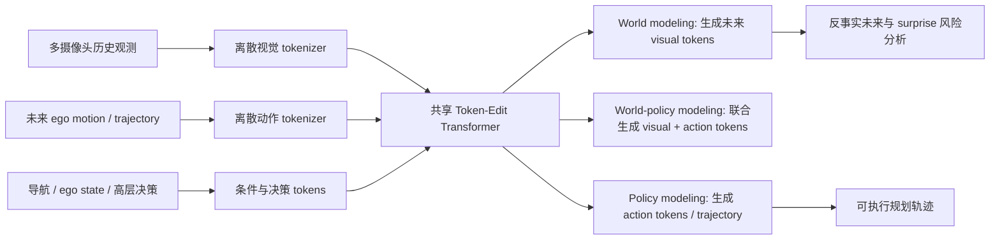

# Discrete-WAM 技术解读

## 基本信息

| 字段 | 内容 |
|---|---|
| 标题 | Discrete-WAM: Unified Discrete Vision-Action Token Editing for World-Policy Learning |
| 来源 | 用户提供的中英文双栏全文 HTML |
| 配套双语 HTML | [`Discrete-WAM-faithful-bilingual.html`](./Discrete-WAM-faithful-bilingual.html) |
| arXiv | 2606.05645v1 |
| 时间 | 2026-06-04 |
| 技术分类 | 自动驾驶 World Action Model / world-policy learning / discrete diffusion / token editing |
| 证据说明 | 以下“事实”来自原文 HTML；“判断/启发”为基于 VLA/WAM 技术脉络的分析。 |

## 1. 三句话总结

Discrete-WAM 的核心是把未来视觉状态、未来 ego action 和高层决策统一到同一个离散 token editing 空间里，用一个 shared Transformer 支持 world modeling、world-policy modeling 和 policy modeling。它反对两类旧路线：端到端自动驾驶只学 state-to-action 相关性，以及连续 latent world model 难以显式表达可组合、可编辑的因果结构。对 WAM 来说，它最值得记住的地方不是“又做了一个 world model”，而是把 action 本身也 token 化为可编辑、可反事实推理的对象。

## 2. 出发点：为什么需要 Discrete-WAM

论文想解决的痛点是：自动驾驶不仅要根据当前状态输出轨迹，还要理解“如果我采取某个动作，世界会怎样变化”。传统端到端 planning 往往把 observation 到 action 当成监督映射，容易学到数据集相关的短路相关性；而连续 latent world model 虽能预测未来，但 latent space 通常缺少明确、可编辑的动作-视觉对齐结构。

因此 Discrete-WAM 的问题定义更像：能否把“未来世界”和“未来行动”放进同一个离散符号空间，让模型可以同时做未来生成、动作生成、反事实编辑和安全评估。

## 3. 要解决的问题

| 问题 | 旧范式的风险 | Discrete-WAM 的回答 |
|---|---|---|
| 动作与未来世界割裂 | policy head 只输出 trajectory，world model 只预测 future image，两者难以共同推理 | visual tokens 与 action tokens 共享离散建模接口 |
| 连续 latent 不可编辑 | latent 难以对应具体动作、决策或场景因果变量 | 使用离散 token editing，把不确定或目标相关 token 作为编辑对象 |
| 固定监督缺少反事实能力 | 只能复现专家轨迹，很难问“如果变道/刹车会怎样” | 支持 controllable future generation 与 counterfactual reasoning |
| 策略学习缺少安全反馈 | L1 / imitation loss 不一定捕捉风险 | 用生成未来和 surprise / reward-guided post-training 引入安全相关反馈 |

## 4. 输入输出

| 模块 | 输入 | 输出 | 作用 |
|---|---|---|---|
| Visual tokenizer | 多摄像头历史观测 / 当前场景 | 离散 visual tokens | 把连续视觉世界压到可编辑 token 空间 |
| Action tokenizer | 未来 ego motion / trajectory | 离散 action tokens | 把控制轨迹变成和视觉 token 可联合建模的对象 |
| Decision conditioning | 导航、ego state、高层驾驶决策 | condition / decision tokens | 为 planning 提供意图和约束 |
| Shared token-edit Transformer | visual/action/decision tokens 的混合序列 | 被补全或编辑后的 future visual/action tokens | 统一支持 world modeling、world-policy modeling、policy modeling |
| Planning output | policy-mode action tokens | 未来 ego trajectory | 部署时用于自动驾驶规划 |
| Counterfactual output | 指定动作或决策条件 | 可控未来观测、风险 surprise | 分析动作对未来世界的因果影响 |

## 5. 核心框图解释

这张图的记忆点是“一个 token 空间，三个任务头/任务模式”。World modeling 负责想象未来世界，policy modeling 负责输出行动，world-policy modeling 则把两者绑在一起，使模型学习 action-conditioned future dynamics。

## 6. 方法与训练策略

论文的主要训练策略可以理解为三层：

| 层级 | 训练目标 | 技术意义 |
|---|---|---|
| 统一离散预训练 | 在 visual/action/decision token 序列上做统一生成或编辑 | 让视觉动态与动作动态共享一个可组合空间 |
| 多任务 world-policy learning | world modeling、world-policy modeling、policy modeling 共同训练 | 避免 world model 和 policy head 各学各的 |
| reward-guided post-training | 使用类似 GRPO 的奖励引导后训练，加强安全与规划指标 | 不只拟合专家轨迹，还引入规划质量和安全偏好 |

推理时最有价值的机制是 token editing：模型不是一次性全量重采样，而是可以根据不确定性选择性替换 token。这个设计对自动驾驶尤其重要，因为不是所有场景区域和时间步都同等重要；风险物体、未来交互区域和高不确定动作应获得更高编辑优先级。

## 7. 创新点

1. 把 future visual state 与 future ego action 都离散化，并在统一 token 空间中建模。
2. 用 shared Transformer 支持 world modeling、world-policy modeling 和 policy modeling，而不是分别训练 world model 与 policy。
3. 用离散扩散/token editing 支持 controllable generation 和 counterfactual reasoning。
4. 引入 reward-guided post-training，让 WAM 不止追求生成似真，还服务 planning 质量。
5. 将 surprise / counterfactual future 与安全评估关联起来，为自动驾驶 world model 提供可解释的风险信号。

## 8. 实验与 insight

原文强调该方法在规划指标与可控未来生成上都有收益，并展示了不同驾驶场景下的未来观测生成、policy attention、counterfactual surprise 与 planning quality 的关系。值得注意的是，surprise 比单纯轨迹 L1 更像“场景风险/因果扰动”的代理信号：当一个动作让未来世界变得不符合模型预期时，规划质量往往也会受影响。

从技术判断看，Discrete-WAM 的实验价值不只是分数，而是证明了一个研究方向：future generation 可以被设计成 policy learning 的结构化监督，而不只是附带可视化。

## 9. 局限与注意事项

| 局限 | 说明 |
|---|---|
| 自动驾驶场景特化 | 离散 action token 和驾驶决策 token 的设计与 ego planning 强绑定，迁移到机械臂需要重新定义动作 token |
| 离散化质量决定上限 | 如果 visual/action tokenizer 丢失接触、微小位姿或长尾物体信息，后续编辑再强也难补回来 |
| 反事实生成不等于真实因果 | counterfactual future 仍是模型内部想象，需要真实闭环或仿真验证 |
| 计算与部署成本 | 统一 token editing 可能比普通 policy head 更重，需要看实时性与硬件约束 |

## 10. 和 VLA / WAM / 具身智能的关系

Discrete-WAM 是自动驾驶版本的 WAM 思想：它把 action-conditioned future modeling 和 policy learning 放到同一个系统里。对 VLA 的启发是，动作不一定只能作为连续向量回归，也可以成为离散、可编辑、可组合的 token；一旦 action token 与 visual token 对齐，模型就能问“做这个动作会导致什么未来”，而不是只问“现在该输出什么动作”。

对机器人来说，它更像一个设计模板：如果我们能为机械臂、灵巧手、移动机器人设计出高保真的 action tokenizer，那么 WAM 可以从“预测视频 + 输出动作”走向“在一个 token 空间中联合编辑未来世界和未来动作”。

## 11. 横向对比中的位置

| 对比对象 | 相同点 | 不同点 |
|---|---|---|
| WALL-WM | 都把 world model 接回 action / policy learning | Discrete-WAM 改的是 token 空间，WALL-WM 改的是训练时间粒度 |
| Seed-RF | 都重定义中间表示单元 | Seed-RF 的 representation token 服务通用图像生成；Discrete-WAM 的 action/visual token 服务 action-conditioned planning |
| Fast-WAM / GigaWorld-Policy | 都关心 world prediction 如何帮助 policy | Discrete-WAM 更强调离散可编辑表示和反事实推理，而不只是训练时辅助监督 |

## 12. 核心思想聚类

Discrete-WAM 属于“离散 action-world token 化”这一类思想。它的关键判断是：为了让世界模型真正服务策略，动作和世界不能只是两个 head，而要在同一个可编辑的结构空间中相互约束。
