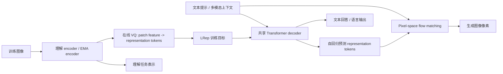

# Seed-RF 技术解读

## 基本信息

| 字段 | 内容 |
|---|---|
| 标题 | Representation Forcing for Bottleneck-Free Unified Multimodal Models |
| 来源 | 用户提供的中英文双栏全文 HTML |
| 配套双语 HTML | [`Seed-RF-faithful-bilingual.html`](./Seed-RF-faithful-bilingual.html) |
| arXiv | 2605.31604v2 |
| 时间 | 2026-06-03 |
| 团队 | HKU / ByteDance Seed / CUHK / Nanjing University / Tsinghua 等 |
| Project | https://yuqingwang1029.github.io/RepresentationForcing |
| 技术分类 | 原生多模态统一模型 / pixel-space generation / representation learning for generation |

## 1. 三句话总结

Seed-RF 的核心问题是：很多“统一多模态模型”表面上统一了理解与生成，但图像生成路径仍依赖冻结的外部 VAE latent space，因此并不真正 bottleneck-free。Representation Forcing 的做法是让 decoder 先自回归生成视觉 representation tokens，再用这些 tokens 在同一 backbone 内指导 pixel-space flow matching 生成图像。它不直接做 robotics action，但对 native VLA / WAM 很关键，因为它提供了一种“把内部表征变成可生成中间目标”的设计模式。

## 2. 出发点：为什么要去掉 VAE 瓶颈

论文指出，现有 unified multimodal models 往往有两个路径：语言用 next-token prediction，图像生成用 diffusion，但 diffusion 通常跑在预训练冻结 VAE 的 latent space 中。这会带来结构性瓶颈：图像的生成空间不是模型自己端到端学出来的，而是继承外部 VAE 的压缩偏好。

直接去掉 VAE、在像素空间生成又会出现质量差距，因为统一模型要同时学习高层语义结构和低层纹理细节。Representation Forcing 的出发点是：既然理解路径里的视觉 encoder 已经学习到高层结构表示，那么生成路径也应该先学会预测这些表示，再把它们渲染成像素。

## 3. 要解决的问题

| 问题 | 旧范式的风险 | Seed-RF 的回答 |
|---|---|---|
| 统一模型仍依赖外部 VAE | 生成质量受冻结 latent space 限制，端到端不彻底 | 直接在 pixel space 生成，移除预训练 VAE |
| 朴素 pixel diffusion 缺少结构支架 | 同时学语义布局和纹理细节过难，图像质量掉 | 先预测 representation tokens，再生成像素 |
| 理解与生成空间割裂 | encoder 表示只服务理解，generation latent 来自外部模型 | 用 encoder 的表示作为 decoder 的生成目标 |
| 表示空间容易不稳定 | 联合训练中 encoder feature 持续变化 | 用 EMA encoder + online VQ + Sinkhorn balancing 稳定离散 token |

## 4. 输入输出

| 阶段 | 输入 | 输出 | 训练/推理含义 |
|---|---|---|---|
| 理解编码 | 图像 / 多模态上下文 | patch-level visual features | 为理解任务提供视觉表示 |
| 表示离散化 | EMA encoder features | representation token indices | 在线向量量化，不依赖外部 tokenizer |
| decoder 表示预测 | 文本 token / 上下文 token | autoregressive representation tokens | 让模型先生成高层视觉结构 |
| pixel-space flow matching | 文本 + predicted representation tokens + noise patches | image pixels / patches | 由表示 token 提供 in-context structural guidance |
| 理解任务输出 | 图像/文本上下文 | 文本回答 | 共享 backbone 提升理解与生成一致性 |

## 5. 核心框图解释

这张图最核心的记忆点是：Representation Forcing 把“理解 encoder 的视觉表示”从感知输出变成生成目标。推理时没有真实图像，decoder 必须仅凭文本先想象出 representation tokens，然后这些 tokens 留在上下文里约束像素生成。

## 6. 方法与训练策略

### 6.1 表示 token 从哪里来

训练时，模型用 EMA encoder 提取图像 patch 级特征，并通过 online vector quantization 把连续特征离散化为 representation tokens。codebook 使用 momentum update，并用 Sinkhorn-Knopp balancing 防止 codebook collapse。

这一步的关键不是“多了一个 tokenizer”，而是 tokenizer 不是外部预训练、冻结的 VAE；它跟 unified model 的理解 encoder 绑定，是模型内部可共同演化的表示空间。

### 6.2 decoder 如何学习

decoder 在统一序列中处理文本 token、representation token 和 pixel patch。文本 token 与 representation token 使用 next-token prediction；pixel patch 使用 flow matching / velocity loss 从噪声生成。

因此 RF 形成两种 forcing：

| Forcing | 含义 |
|---|---|
| encoder -> decoder | 理解 encoder 的视觉表示强迫 decoder 学会预测高层结构 |
| representation -> pixel | decoder 预测出的表示强迫像素生成遵循语义布局 |

### 6.3 训练细节

原文给出的重要训练细节包括：AdamW，beta1=0.9、beta2=0.95、epsilon=1e-8，weight decay 0.1，gradient clipping 1.0；Stage 1-2 学习率 5e-5，Stage 3 学习率 2.5e-5；新初始化的 generation 参数使用 4x LR。每 GPU 约 32,768 tokens，采用 NaViT-style variable-resolution batching。

推理时使用 EMA 0.9999，两阶段生成：先从文本提示 top-k sample 完整 representation token sequence，再用 25 steps flow matching denoise pixel patches。CFG 里同时对 representation 和 pixel 分支设置 guidance，原文给出 w_rep=2.0、w_pix=3.0。

## 7. 创新点

1. 把视觉 representation 从“理解路径的输出”变成“生成路径的目标”。
2. 在不依赖外部预训练 VAE 的情况下，让 pixel-space unified model 获得结构引导。
3. 用 online VQ 将联合训练的 encoder feature 稳定离散化，避免另训 tokenizer。
4. 让 representation tokens 留在同一 Transformer 上下文中，作为 pixel diffusion 的 in-context condition。
5. 在统一模型中同时提升生成与理解，而不是只优化图像生成。

## 8. 实验与 insight

原文结论是，带 RF 的 pixel-space unified model 在图像生成上可以匹配强 VAE-based unified model，同时在理解任务上通常优于 VAE 变体。这个结果的重要性在于：VAE latent 并不一定是统一多模态模型的必要前提；如果有一个可靠的内部 representation target，像素空间生成可以成为更自然的 unified learning 路线。

对 embodied control 来说，这个 insight 可以迁移为：action、tactile、state 也许不应该永远依赖外部编码器或 hand-crafted latent，而可以通过类似 RF 的方式变成 backbone 内部先预测、再渲染/执行的中间表示。

## 9. 局限与注意事项

| 局限 | 说明 |
|---|---|
| 不是具身控制论文 | 没有直接 action output、robot benchmark 或 closed-loop control |
| 表示 token 仍依赖 encoder 质量 | 如果 encoder 学到的表示不含空间/物理结构，RF 只能继承这种缺陷 |
| 高分辨率 pixel generation 成本高 | 移除 VAE 可能提升端到端性，但计算成本与训练稳定性需要关注 |
| 对视频/动作扩展仍待验证 | 图像 RF 能否自然扩展到 action-conditioned video / WAM 还需要后续实验 |

## 10. 和 VLA / WAM / 具身智能的关系

Seed-RF 更像是 native multimodal infrastructure，而不是直接的 VLA 模型。它对 VLA/WAM 的关键启发是：统一模型的中间表示不一定要来自外部冻结模块；模型可以把内部理解表示变成生成目标，并让生成过程受这些表示约束。

如果迁移到 robotics，可以设想三种对应关系：

| Seed-RF 概念 | VLA/WAM 中的潜在类比 |
|---|---|
| representation tokens | latent action tokens / contact tokens / event tokens |
| pixel-space flow matching | action-space flow matching / video-action flow matching |
| encoder feature as target | state/action encoder 或 world model feature 作为 policy 训练目标 |
| in-context structural guidance | 用高层计划或事件表示约束低层动作生成 |

## 11. 横向对比中的位置

| 对比对象 | 相同点 | 不同点 |
|---|---|---|
| Discrete-WAM | 都认为中间 token 是统一建模关键 | Discrete-WAM 直接 token 化动作与未来视觉；Seed-RF token 化视觉表示以服务像素生成 |
| WALL-WM | 都反对简单端到端黑盒映射 | WALL-WM 的中间单元是 semantic event，Seed-RF 的中间单元是 representation token |
| Janus / BAGEL / VAE-based UMM | 都追求理解与生成统一 | Seed-RF 明确移除冻结 VAE 瓶颈，并让表示空间端到端参与训练 |

## 12. 核心思想聚类

Seed-RF 属于“原生中间表示生成”这一类思想。它的关键判断是：统一模型不只要统一输入输出格式，还要统一内部生成路径；如果图像生成仍依赖外部 frozen latent，那么 unified model 的统一性是不完整的。
