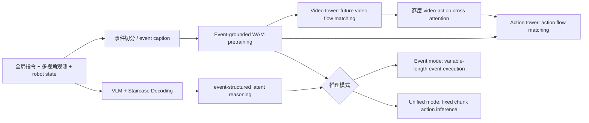

# WALL-WM 技术解读

## 基本信息

| 字段 | 内容 |
|---|---|
| 标题 | WALL-WM: Carving World Action Modeling at the Event Joints |
| 来源 | 用户提供的中英文双栏全文 HTML |
| 配套双语 HTML | [`WALL-WM-faithful-bilingual.html`](./WALL-WM-faithful-bilingual.html) |
| 时间 | 2026-05-29 |
| 团队 | X Square Robot Team / 自变量机器人 |
| Code | https://github.com/X-Square-Robot/wall-x |
| 技术分类 | 机器人 World Action Model / event-grounded VLA pretraining / video-action flow matching |

## 1. 三句话总结

WALL-WM 的核心观点是：机器人 WAM 不应该把固定长度 action chunk 当作天然训练原子，因为语言目标、视觉变化和动作控制发生在不同时间尺度上。它把 action-grounded semantic event 作为 atomic unit，用 event captions 对齐视频和动作段，并从同一个 event-pretrained backbone 支持 event mode 与 unified mode 两种推理接口。它最值得记住的贡献是把 WAM 的关键变量从“模型能不能生成未来”推进到“未来和动作应该沿什么边界切分”。

## 2. 出发点：为什么 fixed action chunk 不够好

现有 VLA/WAM 常用固定长度 action chunk 作为监督单位：给当前观测和语言指令，预测接下来 N 步动作。WALL-WM 认为这个设定存在 granularity mismatch：语言通常描述语义事件，视觉是连续动态，动作控制又有接触级精度，固定时间窗口无法保证三者边界一致。

例如“抓起杯子并放到盘子上”包含 reach、grasp、lift、move、place 等事件。固定长度 chunk 可能切在 grasp 中间，也可能混入多个语义事件，导致模型学到短期相关和动作 shortcut，而不是可组合的行为结构。

## 3. 要解决的问题

| 问题 | 旧范式的风险 | WALL-WM 的回答 |
|---|---|---|
| 固定 chunk 与语言事件不对齐 | 同一 chunk 可能对应半个事件或多个事件 | 用 action-grounded semantic event 作为训练原子 |
| 视觉/动作/语言时间尺度不同 | 强行塞进同一 horizon，语义监督变模糊 | event caption 与对应 video/action segment 对齐 |
| WAM 容易退化成短期动作拟合 | 模型记住局部动作 shortcut，而非长期组合结构 | event pretraining 让模型学习可执行行为片段 |
| 通用推理与标准部署接口冲突 | event-driven rollout 灵活，但工业接口常需要 fixed chunk | 同时支持 event mode 与 unified mode |
| 多视角机器人观测缺少结构约束 | 不同相机信息可能各自为政 | View-Interaction Self-Attention、Camera RoPE、sight-cone mask 强化跨视角一致性 |

## 4. 输入输出

| 模块/模式 | 输入 | 输出 | 作用 |
|---|---|---|---|
| Event pretraining | 当前多视角观测、状态、event caption、event video/action segment | event-conditioned future video + action | 在语义一致的事件边界上学习 world-action dynamics |
| Video tower | 多视角视频 token / future video noise | 未来视频或视频特征 | 学习 action-conditioned physical future |
| Action tower | 状态、动作 noise、video features | 动作序列 / event execution | 通过 cross-attention 绑定动作与视觉动态 |
| Staircase Decoding | VLM 上下文、latent event reasoning | event-structured latent CoT / next-event description | 保留语言推理能力，同时不破坏连续 VLA 梯度路径 |
| Event mode | 当前观测 + 下一事件描述 | variable-length video-action segment | 开放式事件驱动执行 |
| Unified mode | 当前观测 + 指令 + latent reasoning | fixed-horizon action chunk | 兼容标准 VLA 部署 |

## 5. 核心框图解释

这张图最重要的记忆点是：WALL-WM 不只是加一个 world model head，而是把训练数据和模型接口都围绕 event 重组。事件 caption 是语言语义边界，video/action segment 是物理执行边界，两者共同定义 WAM 的训练原子。

## 6. 方法与训练策略

### 6.1 Event-grounded WAM pretraining

WALL-WM 将 action-grounded semantic event 定义为 temporally bounded、semantically coherent、physically executable 的片段。训练时，event caption 与对应视频/动作段配对，使模型学习 `p(video_event, action_event | current observation, state, event caption)`。

这个设计的重点不是更长 horizon，而是更干净的监督边界：语言、视觉和动作在 event level 上天然更容易对齐。

### 6.2 Video-action dual pathway

原文描述中，action tower 与 video tower 深度对应，action tokens 在每层 cross-attend 到 video features，state token 也通过独立 cross-attention 注入。视频和动作都采用 flow matching 形式学习从噪声到未来片段的生成过程。

这比“VLM 输出动作”更接近 WAM：模型学习的是动作和未来视频的联合分布，而不仅是条件动作回归。

### 6.3 多视角与 3D-aware 结构

WALL-WM 用 View-Interaction Self-Attention、Camera RoPE、sight-cone mask、tube patch masking 等结构增强跨视角一致性。对真实机器人很关键，因为操作动作依赖 3D 几何和接触关系，单视角视频生成指标往往不足以衡量可执行性。

### 6.4 Staircase Decoding

Staircase Decoding 用并行/分层 latent CoT 形式注入事件结构推理，而不是逐 token 生成长链文本推理。它的目标是在保留 VLM 语义推理能力的同时，让 VLA 控制路径仍保持梯度连续和可训练。

## 7. 创新点

1. 把 WAM 的训练原子从 fixed-length action chunk 改成 action-grounded semantic event。
2. 通过 event captions 将语言、视频和动作在语义边界上对齐。
3. 从同一个 event-pretrained backbone 支持 event mode 和 unified mode。
4. 设计 video-action 双塔与 cross-attention，使未来视觉动态和动作生成相互约束。
5. 引入多视角结构模块，面向真实机器人操作而不只是单视角视频生成。
6. 使用 Staircase Decoding 将事件级 latent reasoning 接入 VLA/WAM 控制路径。

## 8. 实验与 insight

原文评测包括 embodied video generation 与真实机器人 Task Progress。真实机器人部分尤其值得看，因为它用 0-100 Task Progress 而不只是 binary success，更能反映长任务的部分完成程度。

原文给出的关键趋势包括：event-mode WALL-WM 在 Generalization suite 平均 Task Progress 达到 53.75，高于 DreamZero 28.50、π0.5 24.00 和 WALL-WM-U-Scratch 18.50；在 reasoning-heavy tasks 上 event-mode 平均 71.60，也显著高于多个基线。消融中 event-mode 与 view interaction 对 reasoning manipulation 和 generalization 都有明显提升，支持论文的核心假设：事件边界和跨视角交互都不是装饰，而是 WAM 泛化的结构变量。

## 9. 局限与注意事项

| 局限 | 说明 |
|---|---|
| event 标注/切分成本 | 事件 caption 与 segment 的质量决定上限，大规模自动标注是否稳定仍是关键 |
| 内部平台偏置 | 真实机器人评测与数据生态可能和自研平台强相关，外部复现需要更多开放 benchmark |
| event mode 部署复杂 | variable-length execution 更自然，但工程上比 fixed chunk 更难调度、验证和安全约束 |
| 长期任务仍需高层规划 | event-level WAM 解决片段执行，不等于完整任务树规划已经解决 |

## 10. 和 VLA / WAM / 具身智能的关系

WALL-WM 是 WAM 方向非常关键的一篇，因为它指出 WAM 的难点不只是“能否预测未来视频”，而是“用什么粒度把语言、视觉和动作绑在一起”。如果训练原子切错，模型会把可组合行为学成碎片化 chunk；如果事件边界合理，模型更容易把 reach、grasp、place 等行为复用于新场景。

对 VLA 研究来说，它提供了一个强假设：未来的 generalist robot foundation model 可能需要显式 event interface，而不仅是固定频率 action head。event 可以成为 language plan 和 low-level control 之间的桥。

## 11. 横向对比中的位置

| 对比对象 | 相同点 | 不同点 |
|---|---|---|
| Discrete-WAM | 都把 world prediction 接回 action/policy | Discrete-WAM 主要重构 token space；WALL-WM 主要重构 temporal/event granularity |
| Seed-RF | 都认为中间结构比黑盒映射重要 | Seed-RF 的中间结构是 representation token；WALL-WM 的中间结构是 executable event |
| Fast-WAM / GigaWorld-Policy | 都关心 WAM 如何降低推理成本或服务 policy | WALL-WM 更关注训练原子是否语义一致，而不只是推理时是否生成未来视频 |
| π0.5 / DreamZero | 都在探索机器人 world/action model | WALL-WM 明确批评 chunk-centric optimization，并给出 event-driven 替代 |

## 12. 核心思想聚类

WALL-WM 属于“event-grounded world action modeling”这一类思想。它的关键判断是：动作模型的时间切片不是技术细节，而是决定模型是否能组合、泛化和执行长期任务的核心设计。
